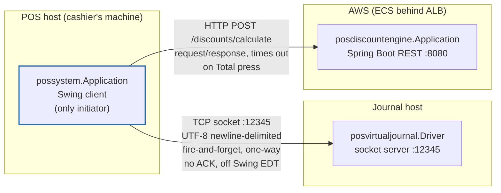
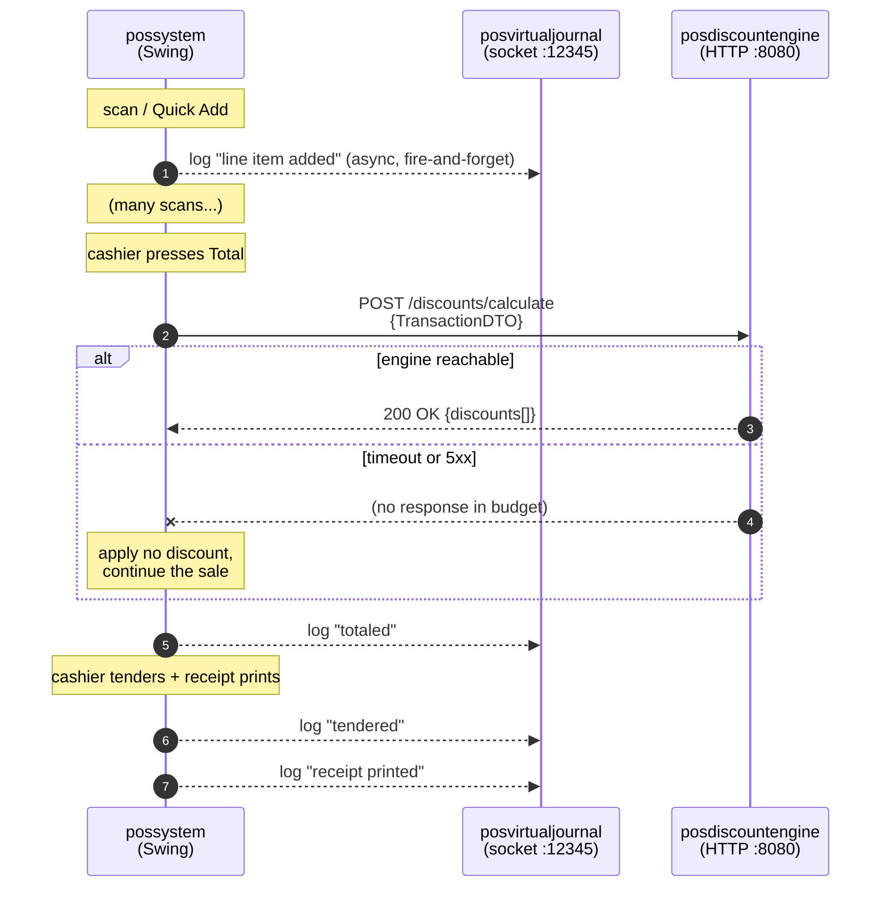
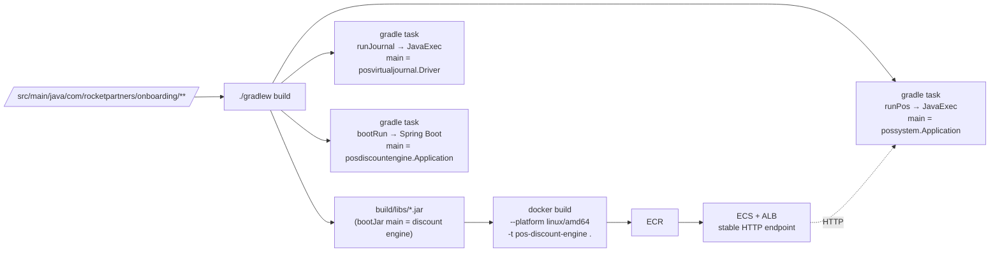

# Architecture

One repo, one `../../build.gradle`, one source tree — three runnable entry points that talk to each other at runtime. Separation is by **package**, not by build module.

## Runtime — three processes, two network hops

**Direction of dependency.** The POS is the only process that initiates anything. The journal server and the discount engine know nothing about each other and nothing about the POS.

**Both hops are optional at runtime.** Journal sends fail silently. Discount calls time out and the sale completes with no discount. This is a hard requirement, not a nicety — the POS must ring up sales with either or both peers down.

**Journal hop specifics (Phase 2).** The POS → journal socket is:
- **One-way and unacknowledged.** The server never writes back; the client never expects to hear anything. Delivery is best-effort. No ACK protocol.
- **UTF-8 newline-delimited.** Pipe-delimited fields; entries are capped at 4096 characters and truncated with a marker. Descriptions with embedded newlines are sanitized at the client so one entry stays one line.
- **Off the Swing EDT.** All work happens on a single daemon `remote-journal-sender` thread. Journal calls from the EDT do a non-blocking `offer()` into a bounded queue and return immediately.
- **Reconnecting under back-pressure.** Connect timeout 2s. On any write failure the sender backs off (`1s → 2s → 4s → 8s → 16s → 30s` cap) rather than reconnecting per entry. Dropped-while-full entries are counted, and one `JOURNAL_DROPPED n=…` line is emitted on recovery so the gap is visible.
- **Unconditional local copy.** Every entry is also written to a `LocalJournal` (stdout by default), so there is always a record even when the remote journal has never been reachable.

## Ring-up, end to end

Only pricing crosses HTTP. Every user action produces a journal line; journal sends are fire-and-forget and never block checkout.

## Package boundaries (single project)

```mermaid
flowchart TB
    subgraph Repo["com.rocketpartners.onboarding"]
        subgraph COMMONS["commons"]
            CM["model"]
            CD["dto"]
            CU["utils"]
        end

        subgraph POSSYS["possystem (Phase 1 → grows in 2 &amp; 3)"]
            PCMP["component<br/>(PosComponent)"]
            PEV["event<br/>(PosEvent, dispatcher, listener)"]
            PDIS["display<br/>(Swing views + controllers)"]
            PREPO["repository<br/>(Pricebook)"]
            PSVC["service<br/>(TransactionService,<br/>JournalClient,<br/>DiscountEngineClient)"]
            PCON["constant"]
        end

        subgraph VJ["posvirtualjournal (Phase 2)"]
            VJALL["Driver + socket handler"]
        end

        subgraph DE["posdiscountengine (Phase 3)"]
            DECMP["component"]
            DECTL["controller"]
            DEENT["entity"]
            DEREPO["repository"]
            DESVC["service"]
        end
    end

    POSSYS -- OK --> COMMONS
    VJ -- OK --> COMMONS
    DE -- OK --> COMMONS

    POSSYS -. socket .-> VJ
    POSSYS -. HTTP .-> DE

    COMMONS -.->|MUST NOT| POSSYS
    VJ -.->|MUST NOT| POSSYS
    DE -.->|MUST NOT| POSSYS
    POSSYS -.->|MUST NOT<br/>import types| DE

    classDef forbidden stroke:#c53030,stroke-dasharray: 4 3,color:#c53030
    linkStyle 5,6,7,8 stroke:#c53030,stroke-dasharray: 4 3
```

**The rules that matter in review** (nothing in the build enforces these — an import that crosses a red line is the main thing to look for):

- `commons` depends on nothing else here. Models, DTOs, utilities only.
- `posvirtualjournal` and `posdiscountengine` never import from `possystem`. They are servers; the POS calls them.
- `possystem` uses `commons`, and talks to the other two **only over the wire**. Importing `posdiscountengine.service.DiscountService` into the POS defeats the whole Phase 3 exercise; the POS communicates with a DTO over HTTP.

## Build → three entry points

Three run tasks distinguished by main class — that's how one project yields three entry points. `bootJar` produces a single fat jar with all three sets of code; its main class points at the discount engine so the container starts the API rather than trying to open a Swing window. `--platform linux/amd64` is required when building on Apple silicon for AWS.

## Cross-references

- Cashier's path through a sale: [user-flow.md](user-flow.md)
- One scan's journey through the event system: [event-flow.md](event-flow.md)
- The nouns (`Item`, `LineItem`, `Transaction`, `Discount`): [domain-model.md](domain-model.md)
