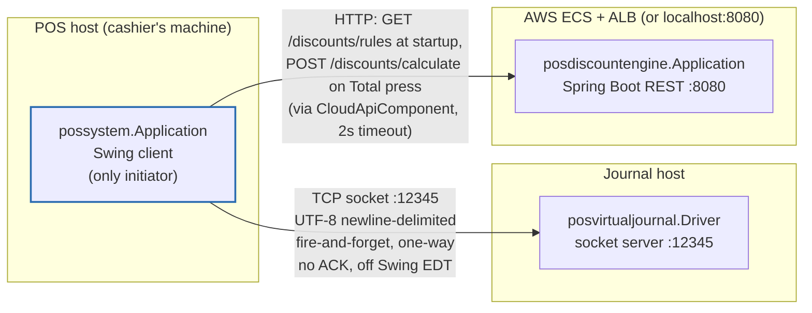
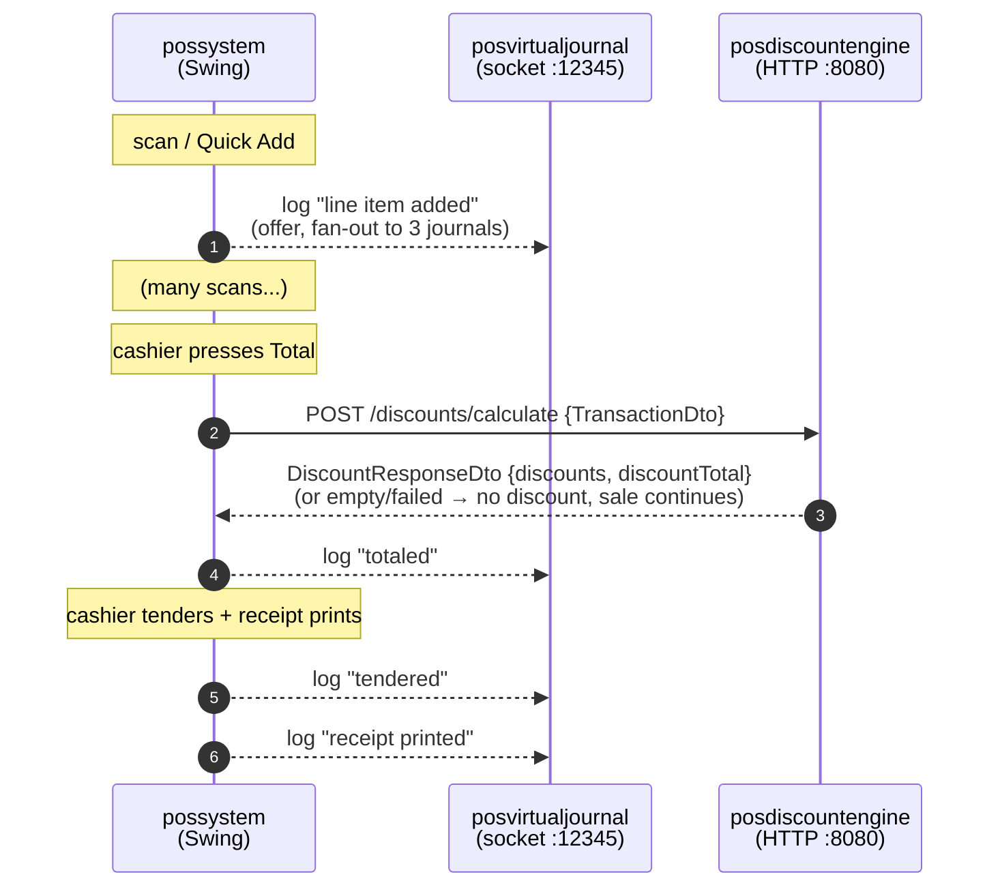
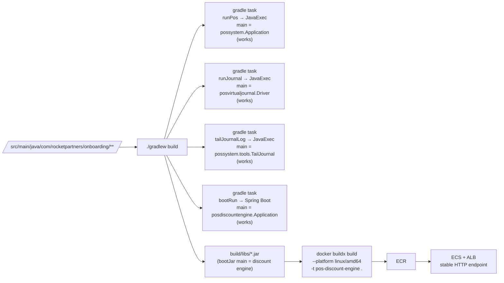

# Architecture

One repo, one `../../build.gradle`, one source tree — four runnable entry points, all live: `runPos`, `runJournal`, `tailJournalLog`, and `bootRun` (the Phase 3 discount engine). Separation is by **package**, not by build module.

## Runtime — three processes, two network hops (both implemented)

**Direction of dependency.** The POS is the only process that initiates anything. The journal server and the discount engine know nothing about each other and nothing about the POS.

**Both hops are optional at runtime — a hard requirement.** Journal writes are best-effort; discount calls time out (2s, in `CloudApiComponent`) and complete the sale with no discount. The POS must ring up sales with either or both peers down. `JournalCrossPhaseTest` is the anti-regression: it pins "Phase 1 stays green when the journal is unreachable."

**Journal fan-out.** The POS runs a composite `Journals(...)` wrapping three concrete `Journal` implementations, all three receiving every entry:

- **`LocalJournal`** — pipe-delimited to stdout; unconditional local record.
- **`FileJournal`** — one JSON object per line, appended to `<log-dir>/journal-YYYY-MM-DD.jsonl`, rolled at UTC midnight. `TailJournal` (and the `tailJournalLog` Gradle task) reads this file.
- **`RemoteJournal`** — ships to the socket server on a dedicated `remote-journal-sender` daemon thread.

**Journal hop specifics (Phase 2).**
- **One-way and unacknowledged.** The server never writes back.
- **UTF-8 newline-delimited.** Pipe-delimited fields; entries are capped at 4096 characters and truncated with `…TRUNCATED`. Embedded newlines are folded at the sender so one entry stays one line.
- **Off the Swing EDT.** Every `journal(record)` call does a non-blocking `queue.offer(...)` and returns; a single daemon sender thread reads the queue and writes the socket.
- **Reconnecting under back-pressure.** Connect timeout 2s. Backoff on failure: `1s → 2s → 4s → 8s → 16s → 30s` cap. The pending record is held across reconnects so ordering is preserved.
- **Full queue drops silently, then reports.** When the sender falls behind, `offer()` returns false and a counter increments; on recovery the sender emits one `JOURNAL_DROPPED n=…` record so the gap is visible.
- **Connection state.** Transitions (`JOURNAL_CONNECTED`, `JOURNAL_UNREACHABLE`, `JOURNAL_DISCONNECTED`) are recorded through `LocalJournal`, and observers (the header status pill) subscribe via `RemoteJournal.setConnectionListener`.

## Ring-up, end to end

Only pricing crosses HTTP. Every user action produces a journal line; journal writes are fire-and-forget and never block checkout, and the discount call is bounded by a 2s timeout so a slow engine cannot stall the tender.

## Package boundaries (single project)

```mermaid
flowchart TB
    subgraph Repo["com.rocketpartners.onboarding"]
        subgraph COMMONS["commons"]
            CM["model"]
            CD["dto"]
            CU["utils"]
        end

        subgraph POSSYS["possystem (Phase 1 → grows in 2 &amp; 3)"]
            PCMP["component<br/>(PosComponent,<br/>Journal impls, buffer)"]
            PEV["event<br/>(PosEvent, dispatcher, listener)"]
            PDIS["display<br/>(Swing views + controllers,<br/>PosTheme, PosDialog)"]
            PREPO["repository<br/>(H2ItemRepository — file mode;<br/>InMemoryItemRepository — tests)"]
            PSVC["service<br/>(TransactionService,<br/>TaxService,<br/>ReceiptFormatter)"]
            PTOOL["tools<br/>(TailJournal)"]
            PCON["constant"]
        end

        subgraph VJ["posvirtualjournal (Phase 2)"]
            VJALL["Driver + socket handler"]
        end

        subgraph DE["posdiscountengine (Phase 3 — live)"]
            DECMP["component<br/>(CsvDiscountsLoader)"]
            DECTL["controller<br/>(Health, Calculate, Rules)"]
            DEENT["entity<br/>(DiscountRule)"]
            DEREPO["repository<br/>(DiscountRuleRepository)"]
            DESVC["service<br/>(DiscountService)"]
        end
    end

    POSSYS -- OK --> COMMONS
    VJ -- OK --> COMMONS
    DE -- OK --> COMMONS

    POSSYS -. socket .-> VJ
    POSSYS -. HTTP .-> DE

    COMMONS -.->|MUST NOT| POSSYS
    VJ -.->|MUST NOT| POSSYS
    DE -.->|MUST NOT| POSSYS
    POSSYS -.->|MUST NOT<br/>import types| DE

    classDef forbidden stroke:#c53030,stroke-dasharray: 4 3,color:#c53030
    linkStyle 5,6,7,8 stroke:#c53030,stroke-dasharray: 4 3
```

**The rules that matter in review** (nothing in the build enforces these — an import that crosses a red line is the main thing to look for):

- `commons` depends on nothing else here. Models, DTOs, utilities only.
- `posvirtualjournal` and `posdiscountengine` never import from `possystem`. They are servers; the POS calls them.
- `possystem` uses `commons`, and talks to the other two **only over the wire**. Importing `posdiscountengine.service.DiscountService` into the POS defeats the whole Phase 3 exercise; the POS communicates with a DTO over HTTP.

## Component shape inside `possystem`

The POS keeps its socket and HTTP integrations behind small in-repo classes rather than importing anything from the server packages:

- **`JournalListener`** — subscribes to every `PosEventType`, formats each event as a `JournalRecord`, and hands it to the composite `Journals(...)`. It is *the* journal integration point; there is no separate "JournalClient".
- **`Journals`** — a composite `Journal` wrapping `LocalJournal`, `FileJournal`, and `RemoteJournal`. Fans one record out to all three.
- **`RemoteJournal`** — owns the socket, queue, sender thread, backoff, and connection listener.
- **`CloudApiComponent`** — the POS's Apache HttpClient5 client to the discount engine, and the *only* seam to Phase 3. Nothing in `possystem` imports a `posdiscountengine` type; it deserializes JSON into `commons.dto`/`commons.model` values by hand and validates the engine's (untrusted) output. Every failure mode — timeout, refused connection, non-2xx, malformed body, validation rejection — becomes an empty/failed result, never an exception into checkout. Modeled on `RemoteJournal`'s resilience. `DiscountViewController` fetches the eligibility rules through it at startup; `CustomerViewController` calls `calculate` at Total.
- **`DiscountSession`** / **`DiscountPreview`** — the transaction-scoped eligibility selection and the one small local preview the POS computes between scans; the engine's `calculate` response at Total is authoritative and replaces the preview.

## Pricebook storage

The pricebook is held in H2 in file mode, not in memory. `H2ItemRepository.open(dbDir, dbName, "/pricebook.tsv")` opens (or creates) `<dbDir>/<dbName>.mv.db`, ensures the `ITEMS` table exists, and — only when the table is empty — seeds it from the classpath TSV. Later runs skip the seed and read straight from the DB, so an operator can edit `ITEMS` in H2 and those edits survive restarts. The bundled `pricebook.tsv` becomes a first-run bootstrap, not the runtime source of truth.

- **Where the file lives.** `--db-dir` (default `data`) and `--db-name` (default `pricebook`) on `runPos`. The `data/` directory is git-ignored.
- **One connection, single-writer.** H2 file DBs are single-writer; the POS keeps one JDBC connection open for the process lifetime, closed on window close via `H2ItemRepository.close()`. Trying to launch a second POS against the same DB file fails loudly rather than silently sharing state.
- **`InMemoryItemRepository` is still in the tree** for tests and anywhere else that wants a pricebook without touching disk. Both implementations parse via the shared `PricebookTsv` helper.
- **The interface is impl-agnostic.** `TransactionService`, `PosComponent`, and every controller depend only on `ItemRepository`, so swapping impls does not ripple.

## Build → runnable entry points

Three run tasks (`runPos`, `runJournal`, `tailJournalLog`) plus `bootRun` distinguished by main class — that is how one project yields multiple entry points. `bootJar` builds a single fat jar whose main class is the discount engine, so the container starts the API rather than opening a GUI. The `Dockerfile` at the repo root copies that jar onto `eclipse-temurin:17-jdk-jammy`; `deploy-ecs.sh` pushes the image to ECR and runs it on ECS Fargate behind an ALB. See [../run-and-test-commands.md](../run-and-test-commands.md) for the full build-and-deploy flow.

## Cross-references

- Cashier's path through a sale: [user-flow.md](user-flow.md)
- Every `PosEvent`, end to end: [event-flow.md](event-flow.md)
- The nouns (`Item`, `LineItem`, `Transaction`, `Discount`): [domain-model.md](domain-model.md)
- Live code-level bugs and dispositions: [../known-issues.md](../known-issues.md)
