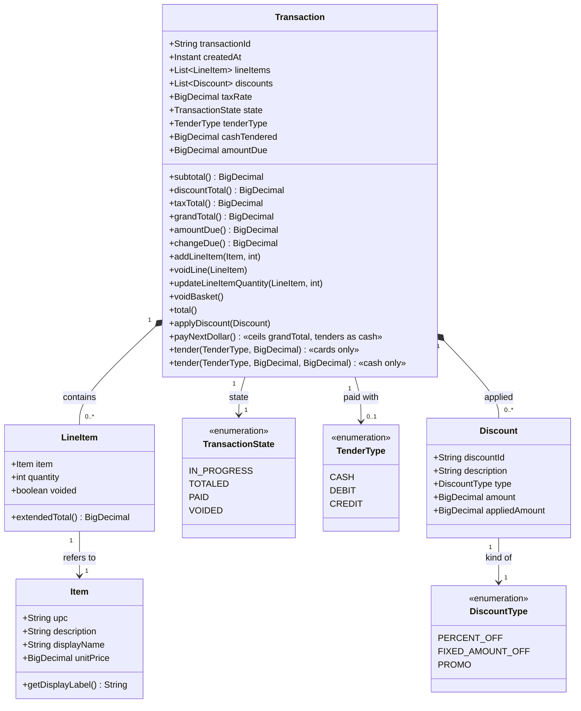
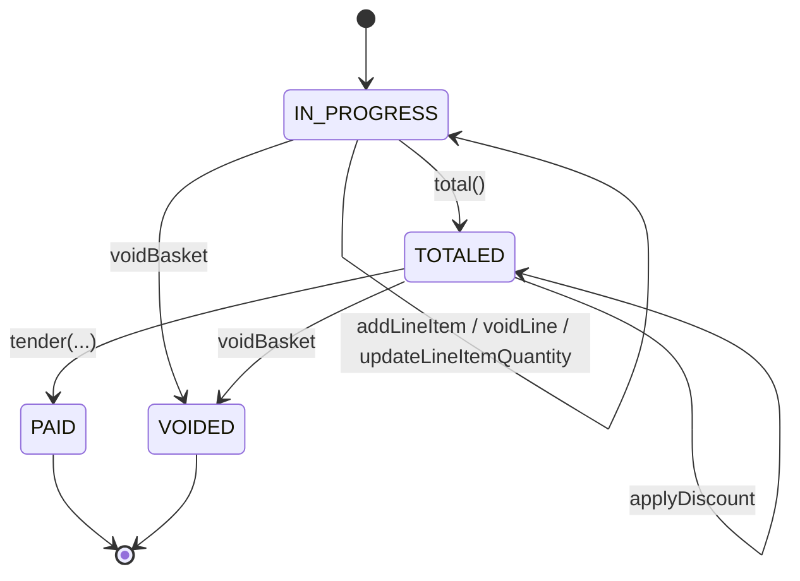

# Domain Model

The nouns of the POS. Names here are the vocabulary from CLAUDE.md — use them exactly in code (`LineItem`, not `CartRow`; `Transaction`, not `Sale`).

## Class diagram

## State machine — `TransactionState`

The state field on `Transaction` mirrors the user flow in [user-flow.md](user-flow.md). It's the single source of truth for which operations are legal.

`addLineItem`, `voidLine`, `updateLineItemQuantity` are illegal in `TOTALED`, `PAID`, and `VOIDED`. `total()` is illegal outside `IN_PROGRESS`. `tender` / `applyDiscount` are legal only in `TOTALED`. `voidBasket` is legal in `IN_PROGRESS` and `TOTALED`. `PAID` and `VOIDED` are terminal. The check lives on `Transaction` (or `TransactionService`), never solely on the button.

## Money — one rounding site

- **`BigDecimal` everywhere.** Never `double`.
- **Intermediate totals are unrounded.** `subtotal()`, `discountTotal()`, `taxTotal()`, and `LineItem.extendedTotal()` return raw values so rounding errors don't compound.
- **`grandTotal()` is the sole rounding site.** Scale 2, `HALF_UP`.
- **Tax.** A flat `taxRate` field on `Transaction`, applied after totaling to the post-discount subtotal: `taxTotal = (subtotal − discountTotal) × taxRate`. Not a per-line concern; `Item` does not carry a taxable flag.

## Next Dollar — the change-simplification device

**Next Dollar ceils the amount due, not the tender.** `Transaction.payNextDollar()` computes `ceil(grandTotal())`, records that ceiled figure as *both* the cash tendered and the settled `amountDue`, and tenders it — so `changeDue()` (`cashTendered − amountDue()`) is exactly $0.00. It measures against the settled amount, not the raw grand total.

**One tap, no entry dialog.** In the restructured cash flow the two common cases finish in a single tap. **Exact Amount** settles the grand total immediately (`TransactionService.tenderCash(grandTotal)`, two-arg tender, `amountDue` null → falls back to the grand total, change $0.00). **Next Dollar** settles the ceiled figure immediately (`TransactionService.payNextDollar()`). Neither opens an entry dialog. Only **Other Amount** opens `PayWithCashView`, where the cashier keys the cash received and change is `cashReceived − grandTotal()` — the path for a customer handing over more than the ceiled amount.

**Why.** To keep coins out of change. On a $7.30 basket:

- **Exact Amount tender:** the customer owes $7.30 and hands over exactly that — $0.00 change. A customer handing over $10.00 goes through **Other Amount**, producing $2.70 change (a quarter, two dimes, and a nickel).
- **Next Dollar tender:** the amount due becomes $8.00 and the customer hands over exactly $8.00 — $0.00 change, no coins. Choosing this asserts the customer handed over the ceiled amount; a customer offering $10.00 instead must go through **Other Amount** (change computed against the true grand total, coins possible).

The customer gives up $0.70 in exchange for a workflow where the coin drawer never opens on this class of tender. That is the substance of the feature, not a rounding footnote. Because Next Dollar now tenders immediately, it must never be "fixed" into an entry dialog — that would undo the one-tap design.

**Corroboration.** `ReceiptFormatter` prints a dedicated `Amount Due (Next Dollar):` line when `amountDue()` differs from `grandTotal()`, so the audit trail records the mode that was used. The `Amount Due (Exact):` variant appears when they match. Both lines print only on PAID transactions.

**What would break the feature.** Computing change against `grandTotal()` instead of `amountDue()`. Someone reading `changeDue()` fresh will squint at `cashTendered − amountDue()` and want to "fix" it to `cashTendered − grandTotal()`. Do not. That change destroys the whole feature: $8.00 tendered against a $7.30 grand total would produce $0.70 change again, and the cashier is back to counting coins.

`Transaction.amountDue()` returns `grandTotal()` when the field is null, so the two-argument (card) tender path is unaffected — this is a strict superset, not a swap.

**Two overloads, split by tender type.** `tender(TenderType, BigDecimal)` accepts `DEBIT` or `CREDIT` only (cards produce no change; the single amount is stored as both `cashTendered` and `amountDue`). `tender(TenderType, BigDecimal, BigDecimal)` accepts `CASH` only, and takes the cash the customer handed over plus the settled amount due; passing `null` for `amountDue` means "same as grand total". Each overload rejects the other's tender types with `IllegalArgumentException` — the split is enforced on the aggregate, not by convention.

## Notes on the shape

- **`Item` vs `LineItem`.** `Item` is the product record from the pricebook — one per UPC. `LineItem` is that product's appearance on a specific Transaction with a quantity; a second scan of the same UPC increments the existing line rather than appending a new one, per `Transaction.addLineItem` and `TransactionService.addItemByUpc`.
- **`Item.displayName`** is a fourth pricebook column (customer-friendly label) that falls back to `description` via `getDisplayLabel()`. Used by `QuickAddTile` and `BasketCellRenderer`. The bundled `pricebook.tsv` carries three columns today, so the fallback path is what actually runs — the code is ready for the fourth column whenever it's added.
- **`Discount` is a value on a Transaction, not a rule.** The rule that produced it (BOGO, "10% off produce", etc.) will live in the discount engine's database (Phase 3). What the POS holds is the *result* of applying a rule: an amount and a description for the Receipt.
- **`Void`** is captured two ways. `voidBasket()` transitions the whole Transaction to the terminal `VOIDED` state; `voidLine` marks a `LineItem` as `voided` (soft-delete keeps the audit trail for the journal). `updateLineItemQuantity(li, 0)` on `TransactionService` routes through `voidLine` — one implementation for both paths.
- **Quantity is always ≥ 1** on a non-voided `LineItem`. `updateLineItemQuantity` is bounded above by `TransactionService.getMaxLineQuantity()` (default `TransactionService.DEFAULT_MAX_LINE_QUANTITY = 999`, error code `ABOVE_MAX_QUANTITY` on overflow). Passing zero is not a quantity change — it is a void.
- **Receipt** is not modeled as a class. It is a render of a `PAID` `Transaction`, produced by `ReceiptFormatter`.

## Where these live

All four nouns are shared vocabulary: they belong in `commons.model` (or their DTO counterparts in `commons.dto` when they cross the wire to the discount engine). `commons` depends on nothing else in the repo — a `Transaction` cannot import from `possystem` or `posdiscountengine`.
