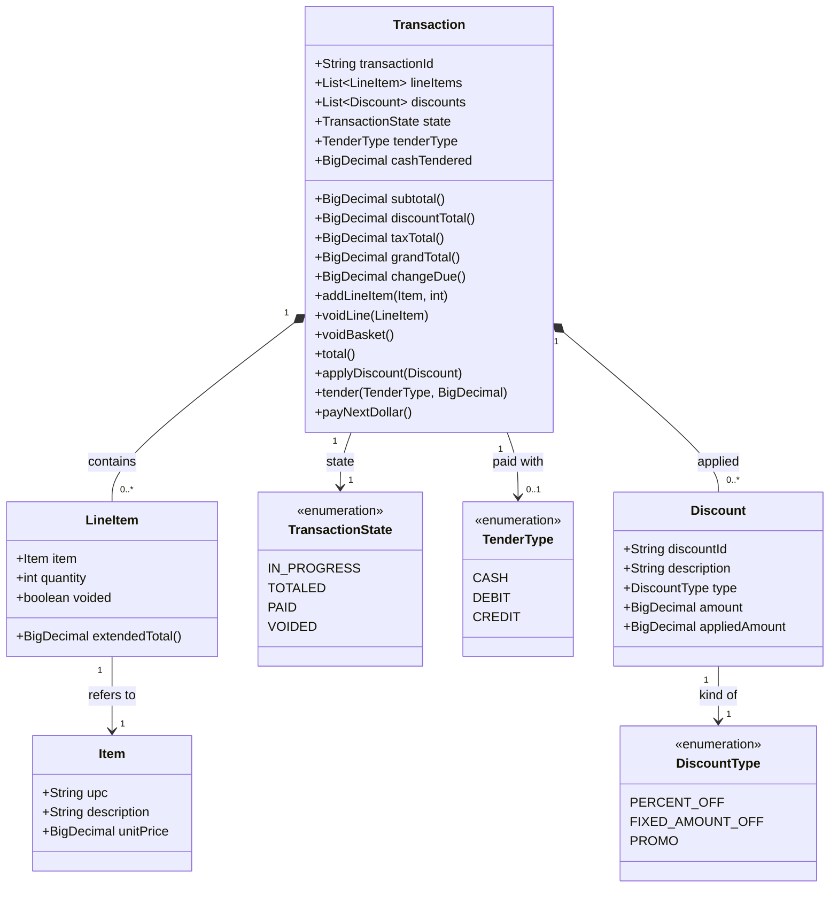
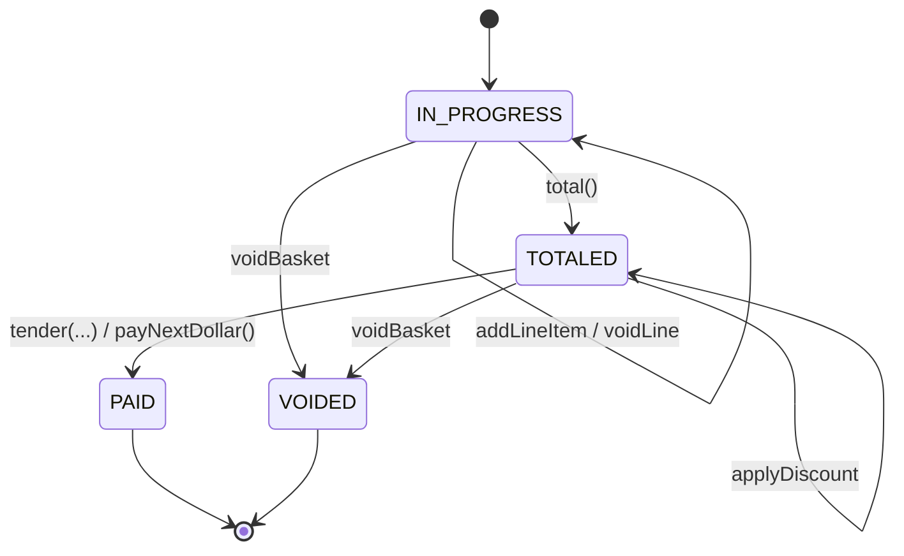

# Domain Model

The nouns of the POS. Names here are the vocabulary from CLAUDE.md — use them exactly in code (`LineItem`, not `CartRow`; `Transaction`, not `Sale`).

## Class diagram

## State machine — `TransactionState`

The state field on `Transaction` mirrors the user flow in [user-flow.md](user-flow.md). It's the single source of truth for which operations are legal.

`addLineItem` and `voidLine` are illegal in `TOTALED`, `PAID`, and `VOIDED`. `total()` is illegal outside `IN_PROGRESS`. `tender` / `payNextDollar` / `applyDiscount` are legal only in `TOTALED`. `voidBasket` is legal in `IN_PROGRESS` and `TOTALED`. `PAID` and `VOIDED` are terminal. The check lives on `Transaction` (or `TransactionService`), never solely on the button.

## Notes on the shape

- **`Item` vs `LineItem`.** `Item` is the product record from the Pricebook — immutable, one per UPC. `LineItem` is that product's appearance on a specific Transaction with a quantity; two scans of the same UPC produce either two `LineItem`s or one `LineItem` with `quantity = 2` (implementation choice — pick one and be consistent).
- **`Discount` is a value on a Transaction, not a rule.** The rule that produced it (BOGO, "10% off produce", etc.) lives in the discount engine's database (Phase 3). What the POS holds is the *result* of applying a rule: an amount and a description for the Receipt.
- **Money is `BigDecimal`.** Never `double`. Rounding happens once, at `grandTotal()`.
- **Tax is a flat, transaction-level rate.** Applied after totaling to the post-discount subtotal — `taxTotal = (subtotal − discountTotal) × taxRate`. Not a per-line concern; `Item` does not carry a taxable flag.
- **`Void`** is captured two ways: `voidBasket()` transitions the whole Transaction to the terminal `VOIDED` state; `voidLine` marks a `LineItem` as `voided` (soft-delete keeps the audit trail for the journal).
- **Pay Next Dollar** is a cash-tender helper on `Transaction`: rounds `grandTotal()` up to the next whole dollar and tenders that amount as `CASH`. A whole-dollar total is a no-op (tenders exactly the total).
- **Receipt** is not modeled as a class here — it's a render of a `PAID` `Transaction`. If a `Receipt` class emerges later, it's a projection, not a new source of truth.

## Where these live

All four nouns are shared vocabulary: they belong in `commons.model` (or their DTO counterparts in `commons.dto` when they cross the wire to the discount engine). `commons` depends on nothing else in the repo — a `Transaction` cannot import from `possystem` or `posdiscountengine`.
