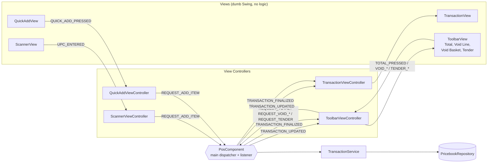

# Event Flow — One Item Scan, End to End

Phase 1's core lesson is event-driven separation of concerns. A `*View` is a dumb Swing renderer: it forwards user input and paints what it's told. All logic lives in `*ViewController` classes, `PosComponent`, and services. Cross-component communication is a typed `PosEvent` dispatched via `IPosEventDispatcher` to any number of `IPosEventListener` subscribers — a class may implement both.

**Reading rule for the diagrams:** ScannerView dispatches a `PosEvent`. The ScannerViewController listens for it, calls `PosComponent`, which delegates to `TransactionService` (pricebook lookup + Line Item creation). `PosComponent` then dispatches a follow-up `PosEvent` announcing the Transaction changed; every view controller that renders Transaction state listens for it and updates its view.

## Sequence — scan → display update

```mermaid
sequenceDiagram
    autonumber
    actor Cashier
    participant SV as ScannerView<br/>(Swing, dumb)
    participant SVC as ScannerViewController<br/>(listener + dispatcher)
    participant PC as PosComponent<br/>(main driver, dispatcher)
    participant TS as TransactionService
    participant PB as PricebookRepository
    participant TVC as TransactionViewController<br/>(listener)
    participant TV as TransactionView<br/>(Swing, dumb)
    participant J as JournalClient<br/>(async, best-effort)

    Cashier->>SV: type UPC + Enter
    SV->>SVC: dispatch PosEvent(UPC_ENTERED, upc)
    SVC->>PC: dispatch PosEvent(REQUEST_ADD_ITEM, upc)
    PC->>TS: addItemByUpc(upc)
    TS->>PB: findByUpc(upc)
    PB-->>TS: Item
    TS-->>PC: LineItem appended to Transaction
    PC->>J: send journal line (fire-and-forget, off EDT)
    PC->>TVC: dispatch PosEvent(TRANSACTION_UPDATED, txSnapshot)
    TVC->>TV: render Line Items + running total
    TV-->>Cashier: updated basket on screen

    note over J: If journal is down the send<br/>fails silently; the sale continues.
    note over PC,TVC: Any view controller that cares<br/>about Transaction state subscribes<br/>to TRANSACTION_UPDATED.
```

## Who dispatches, who listens



**Legend.** Solid arrows are `PosEvent`s dispatched through `IPosEventDispatcher`. Every controller and `PosComponent` implements `IPosEventListener` for the events it cares about; `PosComponent` also implements `IPosEventDispatcher` and is the only class allowed to mutate Transaction state.

A new interaction between components means a **new `PosEvent` type** — never a direct method reference from one view or controller into another.

## What crosses the wire on this scan

- **Journal (Phase 2):** one line, async, off the Swing EDT. See [architecture.md](architecture.md) for the socket hop.
- **Discount engine (Phase 3):** *not on scan.* The engine is called once, when **Total** is pressed. Scans stay local.
