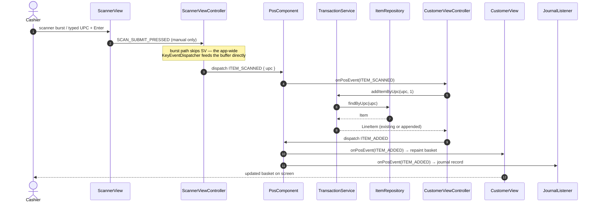
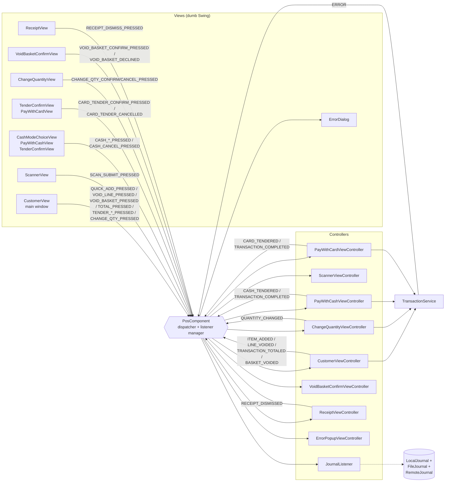

# Event Flow — Every Event, End to End

Phase 1's core lesson is event-driven separation of concerns. A `*View` is a dumb Swing renderer: it forwards user input and paints what it's told. All logic lives in `*ViewController` classes, `PosComponent`, and services. Cross-component communication is a typed `PosEvent` dispatched via `IPosEventDispatcher` to any number of `IPosEventListener` subscribers — a class may implement both.

**Reading rule.** A view dispatches a `PosEvent` on user input. Its controller (or `CustomerViewController`, which owns the main-window logic) listens for it, calls `TransactionService` via `PosComponent`, and then dispatches a follow-up event announcing the change. Every controller that renders transaction state listens for those follow-ups and updates its view.

**Source of truth.** This document is generated by reading `PosEventType` end to end. If an event is dispatched anywhere in the code, it appears somewhere here.

## The real UI shell

There is no `QuickAddView` / `TransactionView` / `ToolbarView` split. Everything the cashier sees lives on one `CustomerView` frame with one `CustomerViewController` driving it:

- **Scan bar** — `ScannerView` + `ScannerViewController`
- **Change-quantity dialog** — `ChangeQuantityView` + `ChangeQuantityViewController`
- **Void-basket confirm dialog** — `VoidBasketConfirmView` + `VoidBasketConfirmViewController`
- **Cash-mode-choice dialog**, **cash-entry dialog**, and **cash tender-confirm dialog** — `CashModeChoiceView`, `PayWithCashView`, `TenderConfirmView`, all driven by `PayWithCashViewController`
- **Card tender-confirm dialog** and **card dialog** — `TenderConfirmView` + `PayWithCardView`, both driven by `PayWithCardViewController`
- **Receipt dialog** — `ReceiptView` + `ReceiptViewController`
- **Error popup** — `ErrorDialog` + `ErrorPopupViewController`
- **Journal writer** — `JournalListener` subscribes to every event and writes a record for it

## The event vocabulary

Every constant on `PosEventType` appears below, grouped by phase of the sale.

### Add-to-basket

| Event | Dispatcher → Consumer | Notes |
| --- | --- | --- |
| `SCAN_SUBMIT_PRESSED` | `ScannerView` → `ScannerViewController` | Manual field submit (typed digits + Enter). Carries `raw`. Controller validates via `Barcodes.isValidUpc` and either forwards as `ITEM_SCANNED` or dispatches `ERROR`. |
| `ITEM_SCANNED` | `ScannerViewController` → `CustomerViewController` | A completed scanner burst *or* a validated manual submit. Carries `upc` and `source`. |
| `QUICK_ADD_PRESSED` | `CustomerView` (a Quick Add tile) → `CustomerViewController` | Carries `upc`. |
| `ITEM_ADDED` | `CustomerViewController` (after `TransactionService.addItemByUpc`) → all listeners | The basket has changed. |

### Line-item edits

| Event | Dispatcher → Consumer | Notes |
| --- | --- | --- |
| `VOID_LINE_PRESSED` | `CustomerView` → `CustomerViewController` | Carries the selected `lineItem` (absent = no-op). |
| `LINE_VOIDED` | `CustomerViewController` → all listeners | Notification that a line was soft-deleted. |
| `CHANGE_QTY_PRESSED` | `CustomerView` → `ChangeQuantityViewController` | Opens the modal. Carries `lineItem`. |
| `CHANGE_QTY_CONFIRM_PRESSED` | `ChangeQuantityView` → `ChangeQuantityViewController` | Carries `lineItem` and `newQuantity` (Integer). |
| `CHANGE_QTY_CANCEL_PRESSED` | `ChangeQuantityView` → `ChangeQuantityViewController` | Dismiss without commit. |
| `QUANTITY_CHANGED` | `ChangeQuantityViewController` → all listeners | Carries `lineItem`, `newQuantity`. A zero quantity is surfaced as `LINE_VOIDED` instead — the two share a single implementation in `TransactionService`. |

### Void basket

| Event | Dispatcher → Consumer | Notes |
| --- | --- | --- |
| `VOID_BASKET_PRESSED` | `CustomerView` → `CustomerViewController` | Opens the confirm dialog. This event alone must not mutate transaction state. |
| `VOID_BASKET_CONFIRM_PRESSED` | `VoidBasketConfirmView` → `VoidBasketConfirmViewController` | Only this event actually voids. |
| `VOID_BASKET_DECLINED` | `VoidBasketConfirmView` → all listeners | Cashier chose *Keep basket*, hit ESC, or closed the window. Carries `itemCount` and `grandTotal` at prompt time. Captured explicitly so a lane racking up near-voids is legible in the shrink review. |
| `BASKET_VOIDED` | `CustomerViewController` → all listeners | Terminal. Carries `itemCount`, `grandTotal`, and `priorState` (`IN_PROGRESS` or `TOTALED`) — post-Total voids are the more interesting case operationally and are distinguishable via `priorState`. `VoidBasketConfirmViewController` only owns the dialog; `CustomerViewController.handleVoidBasketConfirmed()` snapshots the props, calls `voidBasket()`, dispatches this event, and resets. |

### Total and tender

| Event | Dispatcher → Consumer | Notes |
| --- | --- | --- |
| `TOTAL_PRESSED` | `CustomerView` → `CustomerViewController` | Freezes the basket. |
| `TRANSACTION_TOTALED` | `CustomerViewController` → all listeners | Basket is finalised; tender is next. |
| `TENDER_CASH_PRESSED` | `CustomerView` → `PayWithCashViewController` | Opens `CashModeChoiceView`. Rejected with `INVALID_ARGUMENT` if the grand total is $0.00. |
| `CASH_EXACT_PRESSED` | `CashModeChoiceView` → `PayWithCashViewController` | Opens the `TenderConfirmView` seeded with the grand total; tender deferred to `CASH_TENDER_CONFIRM_PRESSED`. `prefillAmount` carried only for journalling which mode produced the tender. |
| `CASH_NEXT_DOLLAR_PRESSED` | `CashModeChoiceView` → `PayWithCashViewController` | Opens the `TenderConfirmView` seeded with the ceiled amount; tender deferred to `CASH_TENDER_CONFIRM_PRESSED`. Disabled on whole-dollar totals. |
| `CASH_TENDER_CONFIRM_PRESSED` | `TenderConfirmView` → `PayWithCashViewController` | Confirm on the cash confirmation dialog. Settles the pending mode: grand total in cash for Exact (change $0.00), `Transaction.payNextDollar()` for Next Dollar (change $0.00). Goes straight to the receipt. |
| `CASH_TENDER_BACK_PRESSED` | `TenderConfirmView` → `PayWithCashViewController` | Back on the cash confirmation dialog: returns to `CashModeChoiceView` without tendering. |
| `OTHER_CASH_AMOUNT_PRESSED` | `CashModeChoiceView` → `PayWithCashViewController` | Opens `PayWithCashView` seeded with the grand total. The only path through the entry dialog; tender deferred to `CASH_CONFIRM_PRESSED`. |
| `CASH_CONFIRM_PRESSED` | `PayWithCashView` → `PayWithCashViewController` | Other Amount path only. Carries raw `cashReceived` string; change is `cashReceived − grandTotal()`. Controller validates and dispatches `CASH_TENDERED` on success, `ERROR` (`INVALID_CASH_AMOUNT` / `UNDERPAYMENT`) on failure. |
| `CASH_ENTRY_BACK_PRESSED` | `PayWithCashView` → `PayWithCashViewController` | Back button on the entry dialog: returns to `CashModeChoiceView` without tendering. |
| `CASH_CANCEL_PRESSED` | Cancel on the mode choice, or ESC on any cash dialog → `PayWithCashViewController` | Abandons the flow; closes every cash dialog; transaction stays `TOTALED` and re-tenderable. No tender event. |
| `TENDER_DEBIT_PRESSED` | `CustomerView` → `PayWithCardViewController` | Opens the `TenderConfirmView` for the card charge; processing deferred to `CARD_TENDER_CONFIRM_PRESSED`. |
| `TENDER_CREDIT_PRESSED` | `CustomerView` → `PayWithCardViewController` | As above. |
| `CARD_TENDER_CONFIRM_PRESSED` | `TenderConfirmView` → `PayWithCardViewController` | Confirm on the card confirmation dialog. Opens `PayWithCardView` and schedules the simulated approval off the EDT for the pending tender type. |
| `CARD_TENDER_CANCELLED` | Cancel/ESC on the card confirmation dialog → `PayWithCardViewController` | Abandons the tender; closes the dialog; transaction stays `TOTALED`. No tender event. |
| `CASH_TENDERED` | `PayWithCashViewController` → all listeners | Carries `tenderType`, `amountTendered`, `amountDue`, `changeDue`. |
| `CARD_TENDERED` | `PayWithCardViewController` → all listeners | Carries `amountTendered` (= grand total), `changeDue` (= zero), `tenderType` (DEBIT or CREDIT). |
| `TRANSACTION_COMPLETED` | Tender controller → `ReceiptViewController` (and all listeners) | Carries the paid `transaction`, `tenderType`, `amountTendered`, `changeDue`. Consumers render the receipt. |

### Post-sale

| Event | Dispatcher → Consumer | Notes |
| --- | --- | --- |
| `RECEIPT_DISMISS_PRESSED` | `ReceiptView` → `ReceiptViewController` | Cashier tapped *Start Next Sale*. |
| `RECEIPT_DISMISSED` | `ReceiptViewController` → all listeners | Reset the basket and open a fresh transaction. |

### Cross-cutting

| Event | Dispatcher → Consumer | Notes |
| --- | --- | --- |
| `ERROR` | Anywhere → `ErrorPopupViewController` (and any listener) | Carries `code`, `message`, and often `cause`. `TransactionService` dispatches before rethrowing so listeners hear about it even when the caller catches. See CLAUDE.md's error-code table for the full vocabulary. |

## Scan → line item, end to end

`JournalListener` subscribes to every `PosEventType`; the journal side of every arrow above (and every arrow in every table above) is a record written to `LocalJournal` (stdout), `FileJournal` (daily JSONL under `logs/`), and `RemoteJournal` (socket to the virtual journal server). See [architecture.md](architecture.md) for the fan-out.

## Who dispatches, who listens

**Legend.** Solid arrows are `PosEvent`s dispatched through `IPosEventDispatcher`. `PosComponent` is the only class allowed to mutate transaction state (through `TransactionService`) and the only central dispatcher. A new interaction between components means a **new `PosEvent` type**, never a direct method reference from one view or controller into another.

## What crosses the wire

- **Journal (Phase 2).** Every event → one record → three journals (fan-out). The remote socket hop enqueues via non-blocking `offer()` and ships on a dedicated `remote-journal-sender` daemon thread. See [architecture.md](architecture.md).
- **Discount engine (Phase 3).** Not implemented yet. The design calls for one HTTP hop on `TOTAL_PRESSED`; nothing crosses HTTP today.
