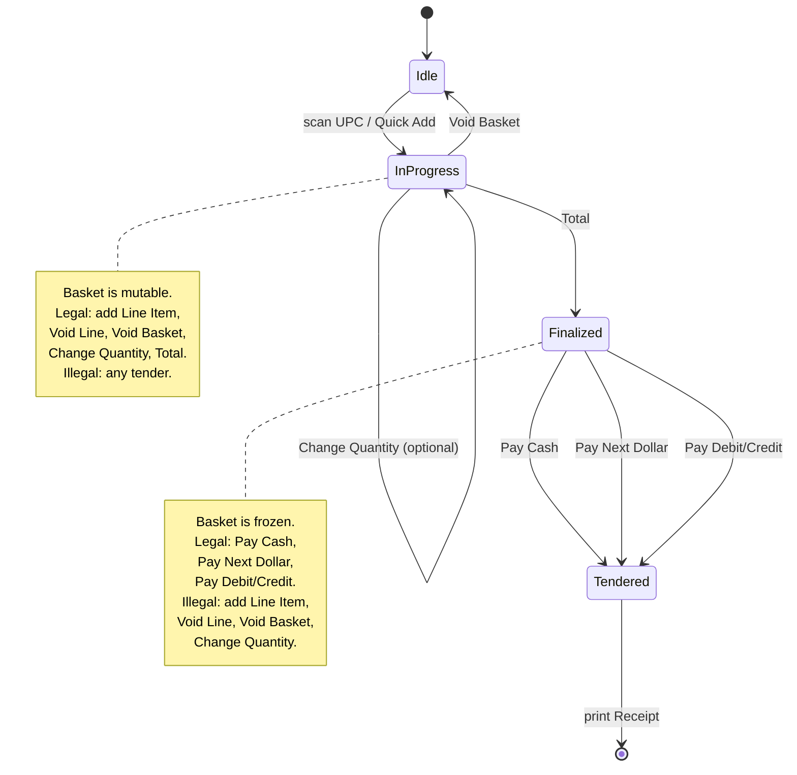
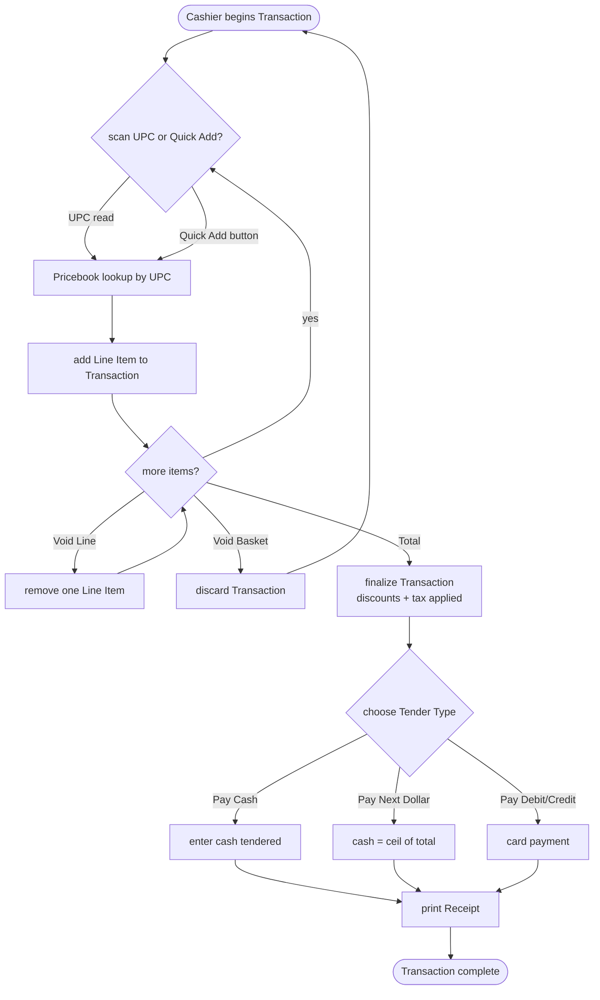

# User Flow — Cashier's Path Through a Sale

The cashier drives one Transaction from empty basket to Receipt. Pressing **Total** is the hinge: before Total the basket is mutable; after Total it is finalized and only tender actions are legal. `PosComponent` / `TransactionService` enforce this — disabling buttons in the UI is a nicety, not the guarantee.

## States and legal actions

## Happy-path walkthrough

## The invariant, restated

Before **Total**: any of `scan UPC`, `Quick Add`, `Void Line`, `Void Basket`, `Change Quantity` is legal; no tender is legal.

After **Total**: any of `Pay Cash`, `Pay Next Dollar`, `Pay Debit/Credit` is legal; no basket mutation is legal.

Every action in either state produces a journal entry (see [event-flow.md](event-flow.md) and Phase 2).
