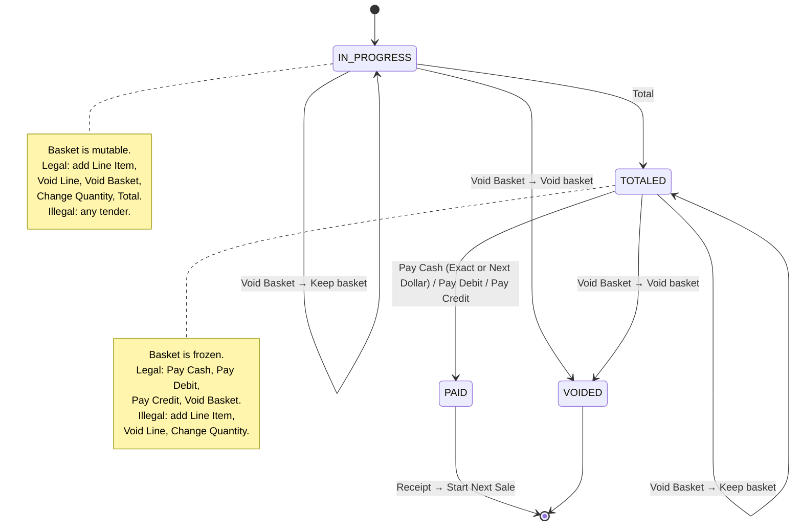
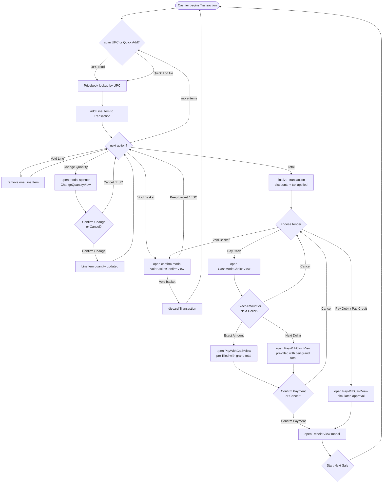

# User Flow — Cashier's Path Through a Sale

The cashier drives one Transaction from empty basket to Receipt. Pressing **Total** is the hinge: before Total the basket is mutable; after Total it is finalized and only tender actions plus Void Basket are legal. `Transaction` and `TransactionService` enforce this — disabling buttons in the UI is a nicety, not the guarantee.

The scanner has both a burst-detection path (a real scanner types keystrokes application-wide) and a manual submit path (typing digits into the scan field and hitting Enter). That distinction is below the level a cashier-facing flow diagram should carry — the states below say "scan UPC" and mean both. See [event-flow.md](event-flow.md) for the mechanics.

## States and legal actions

## Happy-path walkthrough

## The invariant, restated

Before **Total**: any of `scan UPC`, `Quick Add`, `Void Line`, `Change Quantity`, `Void Basket` is legal; no tender is legal.

After **Total**: any of `Pay Cash`, `Pay Debit`, `Pay Credit`, `Void Basket` is legal; no basket mutation is legal.

Void Basket is legal in both states. Post-Total voids are the more interesting case operationally — captured on the `BASKET_VOIDED` event as `priorState`. A `VOID_BASKET_DECLINED` (Keep basket / ESC / window close) is journalled too, as the shrink-review signal.

Every action in either state produces a journal entry (see [event-flow.md](event-flow.md) and Phase 2).
